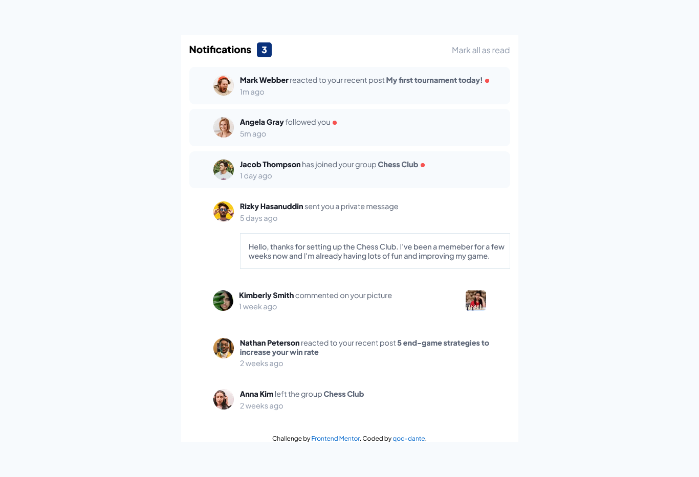

# Frontend Mentor - Notifications page solution

This is a solution to the [Notifications page challenge on Frontend Mentor](https://www.frontendmentor.io/challenges/notifications-page-DqK5QAmKbC). Frontend Mentor challenges help you improve your coding skills by building realistic projects. 

## Table of contents

- [Overview](#overview)
  - [The challenge](#the-challenge)
  - [Screenshots](#screenshot)
  - [Links](#links)
- [My process](#my-process)
  - [Built with](#built-with)
  - [What I learned](#what-i-learned)
  - [Continued development](#continued-development)
  - [Useful resources](#useful-resources)
- [Author](#author)
- [Acknowledgments](#acknowledgments)

## Overview

### The challenge

Users should be able to:

- Distinguish between "unread" and "read" notifications
- Select "Mark all as read" to toggle the visual state of the unread notifications and set the number of unread messages to zero
- View the optimal layout for the interface depending on their device's screen size
- See hover and focus states for all interactive elements on the page

### Screenshots

#### Desktop 1440px (Challenge width)

#### Desktop 1366px (My Desktop's Width)

#### Mobile 375px (Challenge width)

### Links

- Live Site URL: [Github live site](https://qod-dante.github.io/Notifications-Page-by-qod-dante/)

## My process

### Built with

- Semantic HTML5 markup
- CSS Grid
- Mobile-first workflow (Still trying to learn this)
- JavaScript

### What I learned

Well... I just used this project to learn more about JavaScript. I'm still on the bare-bone basics, but I hope to learn more with the
next projects of Frontend Mentor.

### Continued development

Definitely want to learn more JavaScript, especially focusing more on Functions, Arrow Functions, all kinds of Loops, Arrays, Objects, and
more on the DOM.

On CSS I want learn about Animations, Tooltips, Transitions and Transforms.

Once I feel confident enough with the 2 above, I really want to start learning SASS and react.js, then eventuall start learning backend web development.

### Useful resources

Again, aside from [W3 Schools](https://w3schools.com), I did not use any other external resource... it's all just pure. Hard. Code.

## Author

- GitHub - [qod-dante](https://github.com/qod-dante)
- Frontend Mentor - [@Dante](https://www.frontendmentor.io/profile/qod-dante)
- Twitter - [@Dante_Manda](https://twitter.com/Dante_Manda)
- LinkedIn - [Den Manda](https://www.linkedin.com/in/den-manda-172147240/)

## Acknowledgments

Well I guess I can acknowledgment myself... I did this all on my lonesome~